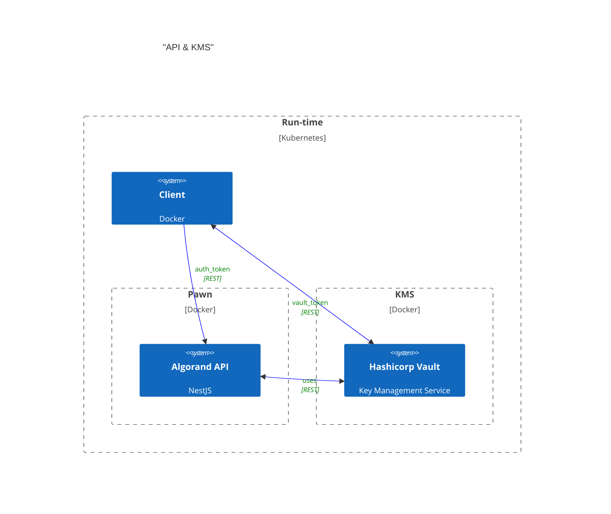
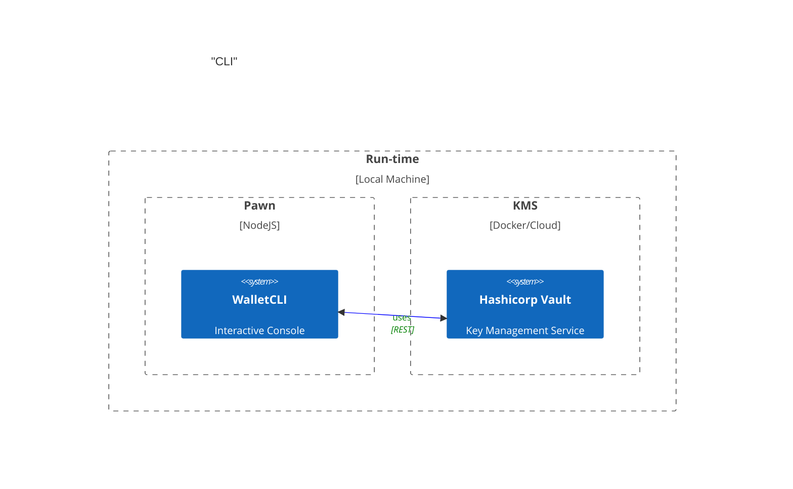

# Intermezzo

Intermezzo uses a traditional KMS (Key Management Service) to manage the keys for Algorand transaction signing and integration. In this specific case, we are using Hashicorp Vault as the KMS.

## For whom is this?

This is primarily for startups, enterprise companies that have strict security policies and requirements for key management. Traditional web3 custody can be expensive and overly complex for most use cases. This is a simple and easy to use solution that can be used by anyone who wants to manage their keys in a secure and compliant way.
## Conceptual Architecture

This pattern ensure that applications comply with the principle of **ISOLATION** between appliation space and "trusted" space; i.e the KMS.
Most web3 applications handle cryptographic keys in-memory and in the same run-time space as the application. This is a security risk as the keys can be easily compromised by an attacker who gains access to the application's memory space.

This ensures that if the application is compromised, the keys are still secure and cannot be accessed by the attacker.

### Integration

Integration expects the client to use REST to communicate and request actions such as creating assets, transferring assets, etc. The client will send a request to the application, which will then forward the request to the KMS for key gen and signing.



### Access Control Policy

This is mostly defined by Hashicorp Vault. The application will use the `approle` authentication method to authenticate with the KMS. Meaning that different roles will have access to different keys.

For most information, you can refer to the [Hashicorp Vault ACL documentation](https://www.vaultproject.io/docs/auth/approle).


# Setup Development Environment

## Build and run docker
```bash
docker compose up -d vault pawn;
```

Now you can open to see endpoint documentation at http://localhost:3000/docs/

> **Note**: The raw OpenAPI JSON spec is dynamically generated and available at http://localhost:3000/docs-json.

But before you can use the API, you need to unseal vault and / or set up the vault keys, if they are not already set up

> **Note**: If you make any changes to the `.env` file, you must redeploy the application for the changes to take effect. You can do this by running:

```bash
docker compose down pawn
docker compose up -d pawn
```

## Setup Vault Keys

Go inside the pawn container with:

```bash
docker exec -it proofmint_pawn ash
```

And run the following command:

```bash
yarn run vault:development:init
```

This will unseal vault and get tokens. If you are running this for the first time, it will also create users, setup hashicorp's transit engines, setup access policies for the different roles, and create the vault keys.
Note that, every time you restart the vault container, you need to unseal, which means you need to run this command.
This command's output will provide you 4 important pieces of information:

1) Vault Root Token
2) Token for "pawn_managers_approle"
3) Token for "pawn_users_approle"
4) Manager's public Algorand address
5) Make sure Manager's address has enough ALGO for usage OR to run integration tests. You can use https://bank.testnet.algorand.network/ to dispense some ALGO.

You can re-run `vault:development:init` whenever you want.

## HTTP API mode

### Authentication (During Development)

1. Copy the `role_id` and `secret_id` tokens from `pawn_managers_approle` or `pawn_users_approle` where you obtained `vault:development:init`.

2. Get a JWT `auth`.`client_token` using the vault's `/v1/auth/approle/login` endpoint (http://localhost:8200/v1/auth/approle/login).

```
POST http://localhost:8200/v1/auth/approle/login

{
  "role_id": "3ab5dada-ec1d-34a6-19ed-d63c9f6eba9c",
  "secret_id": "e857e495-48b2-ab69-3cd1-99f6fe44ccc1"
}
```

3. Use this `client_token` and get a JWT `access_token` for pawn's sign-in endpoint.

```
POST http://localhost:3000/v1/auth/sign-in/

{
    "vault_token": "{your_client_token_will_be_here}"
}
```

4. Add your `access_token` to every endpoint in the header like:

```
Authorization: Bearer {access-token}
```

## CLI mode
Pawn also supports a CLI mode, in which you can use for a personal wallet and tool. 



### How to run the CLI

1) Make sure you have ran `yarn` to install dependencies.
2) Check the .env file and changes the `VAULT_ROLE_ID` and `VAULT_SECRET_ID` to the ones you obtained from `pawn_managers_approle` or `pawn_users_approle`.

    2.1) __If your vault is deployed remotely, you need to change the `CLI_USE_LOCAL_VAULT` to `false` and set the `VAULT_BASE_URL` to your remote vault address.__
    
3) Run the CLI command:

```
yarn run start:dev -- --entryFile repl
```

4) You should see a prompt like this:

```ts
[9:40:07 PM] Starting compilation in watch mode...

[9:40:10 PM] Found 0 errors. Watching for file changes.

[Nest] 102986  - 04/06/2025, 9:40:11 PM     LOG [NestFactory] Starting Nest application...
[Nest] 102986  - 04/06/2025, 9:40:11 PM     LOG [InstanceLoader] HttpModule dependencies initialized
[Nest] 102986  - 04/06/2025, 9:40:11 PM     LOG [InstanceLoader] ConfigHostModule dependencies initialized
[Nest] 102986  - 04/06/2025, 9:40:11 PM     LOG [InstanceLoader] ConfigModule dependencies initialized
[Nest] 102986  - 04/06/2025, 9:40:11 PM     LOG [InstanceLoader] ChainModule dependencies initialized
[Nest] 102986  - 04/06/2025, 9:40:11 PM     LOG [InstanceLoader] VaultModule dependencies initialized
[Nest] 102986  - 04/06/2025, 9:40:11 PM     LOG [InstanceLoader] JwtModule dependencies initialized
[Nest] 102986  - 04/06/2025, 9:40:11 PM     LOG [InstanceLoader] AuthModule dependencies initialized
[Nest] 102986  - 04/06/2025, 9:40:11 PM     LOG [InstanceLoader] WalletCLIModule dependencies initialized
[Nest] 102986  - 04/06/2025, 9:40:11 PM     LOG REPL initialized
> 
```

### Sample commands

`Note`: _The following commands assume the authenticated user is of role **manager**. If you want to test as a less permissioned **user**, you need to change the `VAULT_ROLE_ID` and `VAULT_SECRET_ID` in the `.env` file to the ones you obtained from `pawn_users_approle`. Also, the calls `getAddress` and `sign` will require you to manually pass the specific KeyName and vaultKeyPath. See `wallet.cli.controller.ts` for more details._

1) **Fetch the WalletCLI object instance in console**
```ts
wallet = get(WalletCLI)
```

2) **Login to the vault, using the `VAULT_ROLE_ID` and `VAULT_SECRET_ID` from the `.env` file.**


```ts
await wallet.login(process.env.VAULT_ROLE_ID, process.env.VAULT_SECRET_ID, process.env.VAULT_TRANSIT_MANAGERS_PATH)
```

`login` also requires you to provide a valid path to the vault transit key. This is the path where the vault will store the keys for signing. Some roles might not have access to the transit key, so make sure you have access to the path.

3) **Fetch the address for the authenticated user**
```ts
// Get the wallet address and last round
addr = await wallet.getAddress()
```

To display the value of `addr`, simply type `addr` in the console.

4) **Get the last round from the connected node**

```ts
// Get the last round of the wallet
lastRound = await wallet.getLastRound()
```
To change the node you are connected to, you can change the value of `NODE_HOST` in the `.env` file. The default value is `testnet-api.algonode.cloud`.

5) **Fetch instance of Crafter to help craft txns**
```ts
// Get crafter
crafter = wallet.craft()
```
Crafter is a helper class that helps you craft transactions, for each transaction type, you make use of the [Builder Pattern](https://en.wikipedia.org/wiki/Builder_pattern) to build the transaction. The `get()` method returns the transaction object, and the `encode()` method encodes the transaction to be signed.

6) **Create a transaction to pay 10000 microalgos to the wallet address**

```ts
encoded = crafter.pay(10000, addr, addr).addFirstValidRound(lastRound).addLastValidRound(lastRound + 1000n).get().encode()
```

To display the value of `encoded`, simply type `encoded` in the console. You can use any typescript available tools and libraries to help you validate what needs to be signed. 

_Helper methods will be added in the future to help you validate the paylaod of what is to be signed_


7) **Sign the transaction with the wallet**

```ts
sig = await wallet.sign(encoded)
```

8) **Attach the signature to the encoded contents**
```ts
ready = crafter.addSignature(encoded, sig)
```

9) Submit the transaction to the network
```ts
await wallet.submitTransaction(ready)
```

# TESTING

## Unit Tests

``` shell
$ yarn 
$ yarn test
```

## Integration Tests

1) Adding some ALGO to manager:

If your manager address does not have enough ALGO, you need to add some ALGO to run integration tests.

You should have seen the manager address in the `Setup Vault Keys` step.
You can also find the manager address using the `/v1/wallet/manager/` endpoint. You need the manager's `access_token`.
```
GET http://localhost:3000/v1/wallet/manager/
Authorization: Bearer {your-manager-access-token}
```

You can use https://bank.testnet.algorand.network/ to dispense some ALGO.

2) Run tests:

```
yarn test:e2e
```


# Fresh Restart

Since there are vault volumes and side effects of the `vault:development:init` process, if you need a fresh restart, you might want to remove volumes and side effects.

```
sudo rm -rf volumes node_modules dist data;
sudo rm vault-seal-keys.json package-lock.json manager-role-and-secrets.json user-role-and-secrets.json;
```
# SECURITY

It's important to understand that Intermezzo does **NOT** manage security for you. The integrator is responsible for securing the vault's instance, managing access policies or handling of any admin tokens.

Hashicorp Vault has a lot of documentation on how to secure and configure your access policies. You can refer to the [Hashicorp Vault Security documentation](https://www.vaultproject.io/docs/security) or [Hashicorp Vault Access Policies documentation](https://www.vaultproject.io/docs/concepts/policies) for more information.

## User and Manager keys path

Intermezzo uses two different paths for storing keys in vault. One for users and one for managers. These values are defined in the `.env` file as `VAULT_TRANSIT_USERS_PATH` and `VAULT_TRANSIT_MANAGERS_PATH`. Please configure these paths according to your security policies. 

When creating and access keys Intermezzo will append to those paths `/keys/{keyName}`. 

## Vault Configuration and Root token

Although Intermezzo provides a development script to initialize vault, unseal and configure access policies, it's important to understand that this is only for development purposes. You can read the file `vault/development-init.ts` to see what actions are being performed and take that as reference for your own vault configuration.

In production, you should follow Hashicorp Vault's best practices for securing and configuring your vault instance.
